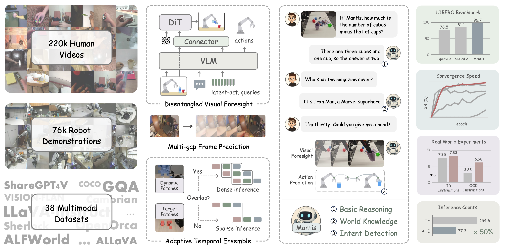

#### Note: This repository is currently undergoing refactoring, which is expected to be completed by December 4th. Please note that running the code at this time may result in errors.


<h3 align="center">
  <a href="https://github.com/zhijie-group/Mantis" style="color:#567053">Mantis: A Versatile Vision-Language-Action Model<br>with Disentangled Visual Foresight</a>
</h3>

<h4 align="center"> 
  If you find our project helpful, please give us a star ⭐ to support us 🙏🙏
</h4>


<h5 align="center">
[](https://arxiv.org/pdf/2511.16175) [](https://huggingface.co/collections/Yysrc/mantis)[](./LICENSE) 
</h5>




#### Create environment

```
cd metaquery_action
conda env create -f environment.yml
conda activate metaquery_action
```


#### LIBERO Setup

Clone and install the [LIBERO repo](https://github.com/Lifelong-Robot-Learning/LIBERO):

```
git clone https://github.com/Lifelong-Robot-Learning/LIBERO.git
cd LIBERO
pip install -e .
```

Additionally, install other required packages:

```
cd ..
pip install -r experiments/robot/libero/libero_requirements.txt
```


#### Training

First, modify the content of the configuration file. The `training_mode` can be set to train either the image generation function or the action generation function. The available options are `"action"`, `"image"`, and `"mix"`.

```
torchrun --nproc-per-node=4 train.py \
	--run_name metaquery_action_test \
	--config_file qwen2p5vl3b_sana.yaml \
    --base_dir /data/yangyi/metaquery_action \
    --logging_dir /data/yangyi/metaquery_action/log \ 
	> /data/yangyi/metaquery_action/log/metaquery_action.log 2>&1
```


#### Evaluation

- Evaluation on LIBERO:

  ```
  sh experiments/libero/run_libero_eval.sh
  ```

  
